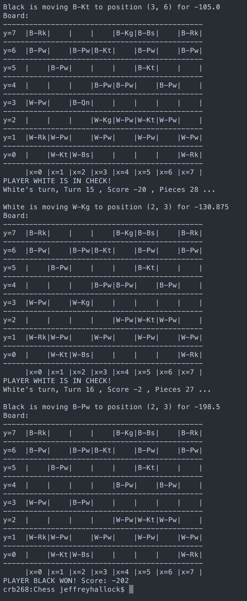

# Chess

This is a chess program, including an AI.

The Strategy design pattern was used to encapsulate piece-type-specific behaviors into concrete subclasses of the Piece_Behavior abstract base class. Every Piece object contains a Piece_Behavior object corresponding to its piece-type. Piece methods like get_moves() are then delegated to the contained Piece_Behavior objects. This allows a piece-type to be changed at runtime (for example, when a pawn reaches the back row) instead of having to delete the piece and replace it with one of a different type.

The AI uses the backtracking algorithm from Skiena (page ..?). A construct_moves() function creates a list of all the valid moves for the given player. For each of these moves, the move is made and the function is recursively called on the opposite player. A “depth” parameter controls how many moves ahead to compute.

To score the board, each piece has an assigned “value”, positive for white pieces and negative for black pieces. The board’s score is the sum of the values of all the pieces still on the board.

The program was written in Python 3.5.

**To Run**

To run the program, call “Python Game.py” from the command line. You can then select whether each player should be controlled by a user (i.e. a person) or the AI. For the AIs you must set a “depth” parameter, which controls how many moves it looks ahead. Anything above 4 is likely to be unplayable.

**Current limitations:**
- No castling
- The game ends upon taking the other player’s king, rather than checkmate. However, the AI will in every case choose to preserve its king over any other move. Therefore in nearly every case, a win against an AI is preceded by a true checkmate. The one exception is a rare stalemate, where the AI is not currently in check but the only valid move on the board puts its king into check. In real chess this would be a tie.
- When a pawn reaches the other side of the board, it turns into a queen rather than providing the option of turning into a different type of piece.
- No en passant (a rare but valid chess move).

